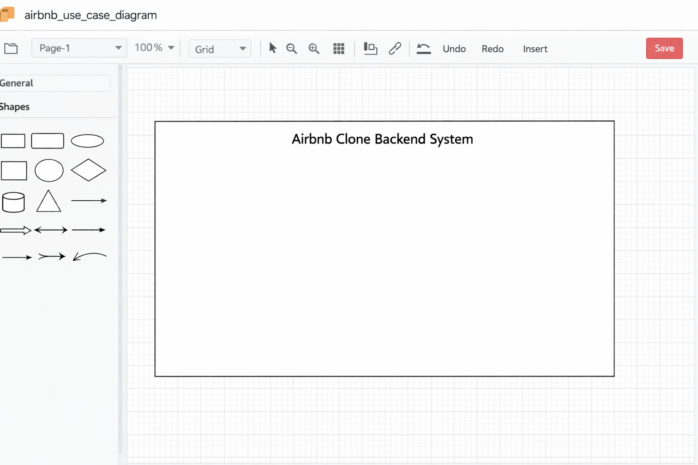

# Airbnb Clone Backend – Use Case Diagram

## Objective

This document describes the **Use Case Diagram** for the Airbnb Clone backend system. The diagram visualizes how different users (actors) interact with the system and its core functionalities.

The actual diagram is designed using **Draw.io (Diagrams.net)** and exported as a PNG file.

---

## Actors

### 1. Guest

A user who searches for properties and makes bookings.

Capabilities:

* Register account
* Log in
* View properties
* Search and filter properties
* Book property
* Make payment
* View bookings
* Cancel booking
* Leave review

---

### 2. Host

A user who lists and manages properties.

Capabilities:

* Register account
* Log in
* Create property listing
* Update property listing
* Delete property listing
* View bookings for owned properties

---

### 3. Admin

A system administrator with full control.

Capabilities:

* Manage users
* Manage property listings
* Manage bookings
* Moderate reviews

---

## Core Use Cases

### Authentication & User Management

* Register user
* Log in user
* Update profile

### Property Management

* Create property listing (Host)
* Update property listing (Host)
* Delete property listing (Host)
* View property listings (Guest)

### Booking System

* Create booking (Guest)
* View bookings (Guest / Host)
* Cancel booking (Guest)

### Payment Processing

* Make payment (Guest)
* Confirm payment (System)

### Reviews

* Leave review (Guest)
* View reviews (Guest)

---

## Diagram Description

The Use Case Diagram includes:

* Actors represented as stick figures (Guest, Host, Admin)
* System boundary labeled **"Airbnb Clone Backend System"**
* Use cases represented as ovals
* Associations connecting actors to their respective use cases

All interactions show how each actor communicates with the backend system.

---

## File Structure

```
use-case-diagram/
 ├── airbnb_use_case_diagram.png
 └── README.md
```

---

## Tool Used

Diagrams.net



---

## Conclusion

This use case diagram provides a high-level visual overview of system interactions, helping developers and stakeholders clearly understand user roles and system responsibilities before implementation begins.
